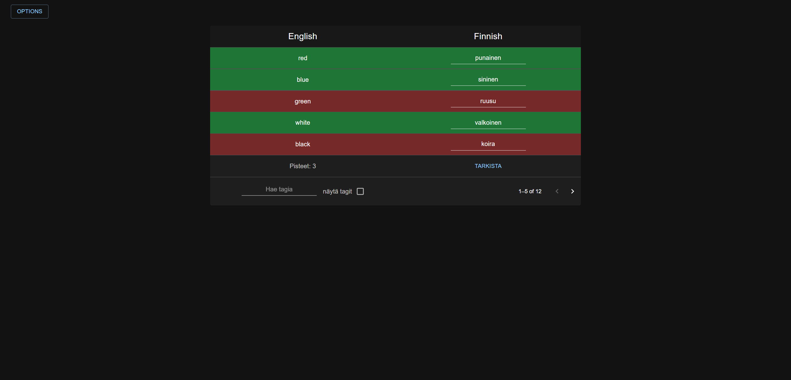

# fullstack-app-2021

> App that is produced as a student project to learn about fullstack development.

The app is used to train English or Finnish depending on what you need practice with.

## Motivation

I'm a student in Tampere University of Applied Sciences (TAMK for short) and this app is a end of course project.
Motivation for the project was getting a good grade for my backend course aswell as improving my skills with node.js and react.

## Try it out!

Heroku link: https://learnenglishfinnish.herokuapp.com/
Screencast:

## Documentation

The JSDocs html files can be found in the docs folder for backend and in the frontend/docs for the frontend.

## Usage example

The app can be used to learn simple and useful words both in English and Finnish.

## Installation

For the main branch, run "npm install" in root folder aswell as the frontend folder.
Then run "nodemon index.js" in the root folder and "npm start" in the frontend folder.

For heroku branch you don't need to install it, just run the heroku link in your browser!

## Screenshots

User view

User view with checked rows

User view with show tags and search

Admin view

## How to use?

If you can speak english or finnish it is pretty straightforward how to use the app.
The buttons tell you what they do, nothing is volatile.

User view is the first view you see and it is used for simulating a user.
In the view you can change language, write answers for words and check your answers.
You can also filter the words by their tags in the "search for a tag" or in finnish "Hae tagia" field.
You can show tags for the words by checking the "show tags" or in finnish "näytä tagit" checkbox.
If you want to start again then just refresh the window.

Admin view is the second view and you can access it by pressing options button.
It will show you a dropdown menu where you can press "Change to admin view" or in finnish "Vaihda admin käyttönäkymään".
This button is used to swap between both views.
In admin view you can edit tags and words, delete words and add words.

To change your language press on options and select "Change language" or in finnish "Vaihda kieli".

## Tech/framework used

Frontend of the app is developed with React.
Backend of the app is developed with Express and Node.js.
MySQL Database hosted by Tampere University of Applied Sciences (TAMK).
